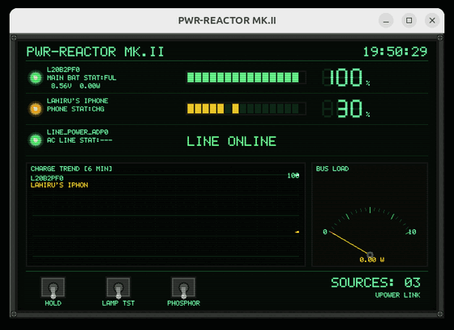
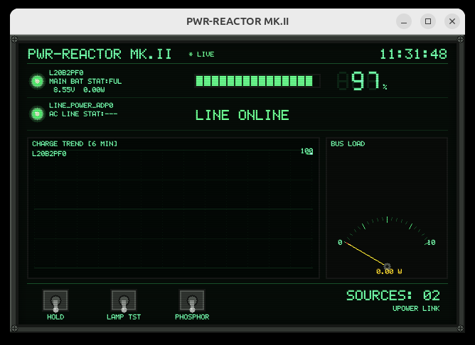
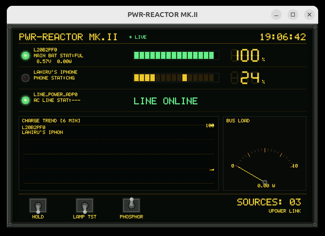

# PWR-REACTOR MK.II

[](https://github.com/lahirunirmalx/PWR-REACTOR/actions/workflows/build.yml)
[](LICENSE)

A retro military CRT/VFD battery monitor for Linux. One panel for every
battery you own: laptop, phones, wireless mice and keyboards, earbuds,
gamepads, UPS units - with desktop alerts before any of them die.



## Why

Your desktop tells you when the *laptop* battery is low. It says nothing
when your wireless mouse is about to die mid-meeting, your earbuds have
5 minutes left, or your phone never actually started charging on that
cable. PWR-REACTOR watches every battery the machine can see, estimates
time remaining, and raises a desktop notification (with a suitably
retro klaxon) before anything dies - all wrapped in a 1970s reactor
control panel aesthetic, because monitoring should be fun.





## Features

- **Live telemetry** for every power source, rescanned every 2 seconds
  (configurable). Sources, in order: `upower`, raw
  `/sys/class/power_supply`, `adb` (Android over USB), KDE Connect and
  GSConnect (phone over Wi-Fi, D-Bus), NUT (`upsc`, UPS units).
- **Low battery alerts**: desktop notifications with hysteresis at
  configurable warn/critical thresholds, optional alert sound.
- **Time estimates**: time-to-empty / time-to-full from upower when
  available, otherwise computed from the observed charge slope.
- **Per-device row**: status lamp, model name, source tag, charge
  state, voltage/wattage, segment bar gauge, 7-segment percent readout.
- **Charge trend scope**: ~6 minutes of history as phosphor-persistence
  traces plus a bus-load histogram.
- **Analog bus-load meter**: damped needle, auto-ranging, peak hold.
- **Dynamic tray icon**: green/amber/red reactor trefoil follows worst
  device state; lowest device percentage shown as a tray label;
  middle-click toggles the panel.
- **Pops up on plug-in**: new device battery raises the panel.
- **Widget mode** (`--widget`): borderless always-on-top mini panel,
  dragged by its header, skipped in the taskbar.
- **Tray resident**: closing the window hides it; quit from the tray
  menu or with `Q`.

## Install

From source:

```sh
sudo apt install libsdl2-dev libgtk-3-dev   # gtk only needed for tray
make
make install            # ~/.local/bin + icons + desktop entry
make install-service    # start with your session, hidden in tray
```

Or grab the `.deb` from
[Releases](https://github.com/lahirunirmalx/PWR-REACTOR/releases):

```sh
sudo dpkg -i power-reactor_*_amd64.deb
systemctl --user enable --now power-reactor
```

Without GTK dev headers the app still builds - it just runs without a
tray icon.

## Controls

| Control    | Key | Action                              |
|------------|-----|-------------------------------------|
| HOLD       | H   | freeze telemetry scanning           |
| LAMP TST   | L   | light every indicator lamp          |
| PHOSPHOR   | P   | switch green / amber phosphor       |
|            | ESC | hide to tray                        |
|            | Q   | quit                                |

CLI flags: `--hidden` (start in tray), `--amber`, `--widget`.

## Configuration

`~/.config/power-reactor.conf` is created with defaults on first run:

```ini
scan_ms=2000        # rescan interval
warn_pct=15         # low battery warning threshold
crit_pct=5          # critical threshold
popup_on_plug=1     # raise panel when a device battery appears
notify=1            # desktop notifications
sound=1             # alert sound
amber=0             # amber phosphor by default
tray_label=1        # lowest device percentage next to tray icon
widget=0            # widget mode by default
widget_x=-1         # widget position, -1 = auto top-right
widget_y=-1
```

## Supported devices

Anything that reports battery state through a standard interface shows
up automatically:

- **USB HID power devices**: wireless mouse/keyboard receivers,
  gamepads (DualShock/DualSense, Xbox via xpadneo), styluses.
- **Logitech Unifying / HID++** receivers (via upower).
- **Bluetooth devices** advertising the GATT battery service: phones,
  earbuds, headsets, mice, keyboards (via BlueZ + upower).
- **iPhones over USB**: via `upower` + `usbmuxd`. Pair/trust the phone
  once for telemetry to appear.
- **Android**: over USB with USB debugging enabled (`adb`), or over
  Wi-Fi through KDE Connect / GSConnect, or paired via Bluetooth.
- **UPS units**: USB HID power-device class (upower) or NUT (`upsc`).

Devices that expose no charge data show dashed digits and a
`NO TELEMETRY` tag.

## Contributing

Issues and PRs welcome - see [CONTRIBUTING.md](CONTRIBUTING.md).

## License

[MIT](LICENSE)
