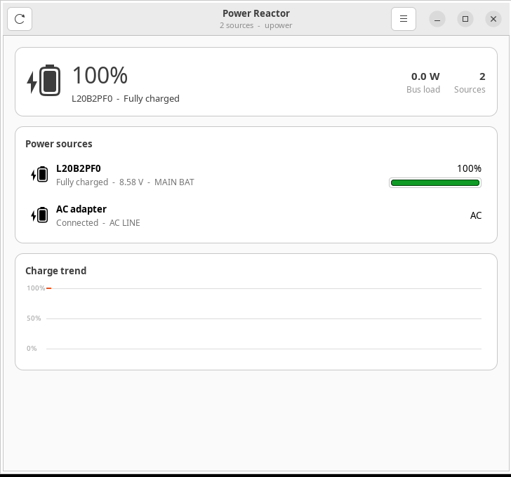
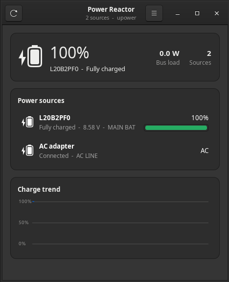

# Power Reactor

[](https://github.com/lahirunirmalx/PWR-REACTOR/actions/workflows/build.yml)
[](LICENSE)

One dashboard for every battery you own: laptop, phones, wireless mice
and keyboards, earbuds, gamepads, UPS units - with desktop alerts
before any of them die.

Built with GTK 3, so it looks native on every Ubuntu from 20.04 LTS to
26.04 LTS and follows your light or dark theme automatically.



## Why

Your desktop tells you when the *laptop* battery is low. It says
nothing when your wireless mouse is about to die mid-meeting, your
earbuds have 5 minutes left, or your phone never actually started
charging on that cable. Power Reactor watches every battery the machine
can see, estimates the time remaining, and raises a desktop
notification before anything dies.

## Features

- **Summary card**: the battery that needs attention first, its charge
  state, the time remaining, total bus load and source count.
- **Per-device rows**: device icon, name, source, charge state, voltage
  and wattage, a themed level bar and the exact percentage.
- **Charge trend chart**: the last few minutes of every battery's
  charge, drawn with cairo in your theme's colours.
- **Low battery alerts**: native desktop notifications with hysteresis
  at configurable warning and critical thresholds, with optional sound.
- **Time estimates**: time to empty and time to full from upower when
  available, otherwise computed from the observed charge slope.
- **Tray resident**: closing the window hides it to the tray; the icon
  turns amber then red as the worst battery drops, and shows the lowest
  percentage as its label.
- **Pops up on plug-in**: a newly connected device battery raises the
  window.
- **Follows the desktop**: Yaru light and dark, your accent colour, and
  the system font. Nothing is hardcoded.

Dark theme and compact mode:



## Install

### From the .deb

Grab the package from
[Releases](https://github.com/lahirunirmalx/PWR-REACTOR/releases):

```sh
sudo apt install ./power-reactor_*_amd64.deb
systemctl --user enable --now power-reactor    # optional: start with your session
```

The published .deb is built on Ubuntu 20.04, so it installs and runs on
20.04, 22.04, 24.04 and 26.04.

### From source

```sh
sudo apt install build-essential pkg-config libgtk-3-dev
make
make install            # ~/.local/bin + icons + desktop entry
make install-service    # optional: start with your session, hidden in the tray
```

Install `libayatana-appindicator3-1` for the tray icon and `upower` for
the richest telemetry. Both are optional: without the indicator library
the app simply runs without a tray icon, and without upower it reads
the kernel directly.

### As a snap

```sh
make snap
sudo snap install --dangerous power-reactor_1.0.0_amd64.snap
```

Strict confinement limits the snap to upower and the kernel. The `adb`,
KDE Connect, GSConnect and NUT sources need host commands the sandbox
does not expose, so use the .deb if you depend on those.

## Controls

| Key            | Action              |
|----------------|---------------------|
| `Ctrl+R` / `F5`| refresh now         |
| `Ctrl+Q`       | quit                |

Closing the window hides it to the tray when a tray icon is available,
otherwise it quits. Only one instance ever runs: launching Power Reactor
again brings the existing window back, which is how you reach it after
`--hidden` on a desktop with no tray support.

CLI flags: `--hidden` (start in the tray), `--compact` (smaller window),
`--dark` (force the dark theme).

## Configuration

`~/.config/power-reactor.conf` is created with defaults on first run:

```ini
scan_ms=2000        # rescan interval
warn_pct=15         # low battery warning threshold
crit_pct=5          # critical threshold
popup_on_plug=1     # raise the window when a device battery appears
notify=1            # desktop notifications
sound=1             # alert sound
dark=0              # force the dark theme, 0 = follow the desktop
tray_label=1        # lowest device percentage next to the tray icon
compact=0           # start in the compact window size
```

## Supported devices

Anything that reports battery state through a standard interface shows
up automatically:

- **USB HID power devices**: wireless mouse and keyboard receivers,
  gamepads (DualShock/DualSense, Xbox via xpadneo), styluses.
- **Logitech Unifying / HID++** receivers (via upower).
- **Bluetooth devices** advertising the GATT battery service: phones,
  earbuds, headsets, mice, keyboards (via BlueZ + upower).
- **iPhones over USB**: via `upower` + `usbmuxd`. Pair and trust the
  phone once for telemetry to appear.
- **Android**: over USB with USB debugging enabled (`adb`), over Wi-Fi
  through KDE Connect or GSConnect, or paired over Bluetooth.
- **UPS units**: USB HID power device class (upower) or NUT (`upsc`).

Devices that expose no charge data are listed with a dash and a
`No telemetry` state.

## Compatibility

The build pins `GLIB_VERSION_MAX_ALLOWED` to 2.64 and
`GDK_VERSION_MAX_ALLOWED` to 3.24, the versions Ubuntu 20.04 ships, so
using a newer API warns at compile time on any machine rather than
failing on someone's older one. CI additionally compiles inside an
`ubuntu:20.04` container on every push.

| Release        | GTK    | Status                      |
|----------------|--------|-----------------------------|
| 20.04 LTS      | 3.24.20| verified in CI container    |
| 22.04 LTS      | 3.24.33| same GTK 3 API              |
| 24.04 LTS      | 3.24.41| verified on a dev machine   |
| 26.04 LTS      | 3.24.x | same GTK 3 API              |

## Layout

```
src/power.[ch]   device discovery, history, estimates, alerts - no toolkit
src/ui.[ch]      GTK 3 dashboard, cairo trend chart, notifications
src/tray.[ch]    StatusNotifier tray icon (libayatana-appindicator, dlopen)
src/main.c       CLI flags and startup
data/            desktop entry, AppStream metadata, systemd user service
```

The data layer knows nothing about GTK, so the panel can be replaced
without touching device discovery.

## Contributing

Issues and PRs welcome - see [CONTRIBUTING.md](CONTRIBUTING.md).

## License

[MIT](LICENSE)
